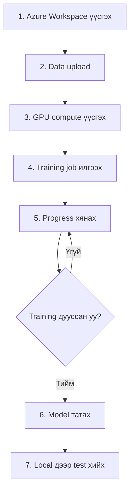

# 🚀 Azure ML Quick Start Guide (Монгол)

## Товч танилцуулга

Энэ хичээл таныг **5 алхмаар** Azure дээр model сургахад туслах юм.

---

## 📋 Бэлтгэл ажил

### 1. Azure SDK суулгах

```powershell
# Python виртуал орчинд суулгах
pip install azureml-core azureml-mlflow azure-storage-blob
```

### 2. Azure нэвтрэх

```powershell
# Azure CLI суулгасан бол
az login

# Эсвэл Python дотор
# Web browser нээгдэж authentication хийнэ
```

---

## 🔷 АЛХАМ 1: Azure ML Workspace үүсгэх

### Аргачлал A: Portal ашиглах (Хамгийн хялбар)

1. **portal.azure.com** руу орох
2. **"Create a resource"** → **"Machine Learning"** сонгох
3. Мэдээлэл оруулах:
   - **Workspace name**: `forex-ml-workspace`
   - **Region**: `East US` эсвэл `Southeast Asia`
   - **Resource group**: шинэ үүсгэх → `forex-training-rg`
4. **"Review + create"** → **"Create"** дарах
5. ⏳ 2-3 минут хүлээх

### Аргачлал B: Python script ашиглах

```python
from azureml.core import Workspace

# Workspace үүсгэх
ws = Workspace.create(
    name='forex-ml-workspace',
    subscription_id='YOUR_SUBSCRIPTION_ID',  # Portal-с олох
    resource_group='forex-training-rg',
    create_resource_group=True,
    location='eastus'
)

print(f"✅ Workspace үүсгэсэн: {ws.name}")

# Config хадгалах (дараа ашиглахын тулд)
ws.write_config(path='.azureml')
```

**Subscription ID-аа хаанаас олох вэ?**

- Portal → **"Subscriptions"** → ID-г хуулах

---

## 🔷 АЛХАМ 2: Өгөгдөл upload хийх

### Өгөгдлийн бүтэц шалгах

```
data/
  train/
    EUR_USD_1min.csv
    GBP_USD_1min.csv
    ...
  test/
    EUR_USD_test.csv
    ...
```

### Upload хийх

```powershell
# Манай бэлтгэсэн script ашиглах
python azure_upload_data.py \
  --data_path ./data \
  --workspace_name forex-ml-workspace \
  --resource_group forex-training-rg \
  --subscription_id YOUR_SUBSCRIPTION_ID
```

**Эсвэл Azure Storage Explorer ашиглах:**

1. [Azure Storage Explorer](https://azure.microsoft.com/features/storage-explorer/) татах
2. Нэвтрэх
3. `forex-ml-workspace` → **Blob Containers** → **azureml-blobstore-...**
4. `forex_data/` folder үүсгэж бүх CSV файл чирж оруулах

⏱️ **Хугацаа:** ~5-10 минут (интернет хурд хамаарна)

---

## 🔷 АЛХАМ 3: GPU Compute үүсгэх

### Portal дээр үүсгэх

1. **Azure ML Studio** руу орох: [ml.azure.com](https://ml.azure.com)
2. Workspace сонгох: `forex-ml-workspace`
3. **Compute** → **Compute clusters** → **+ New**
4. Тохиргоо:
   ```
   Compute name: gpu-cluster
   Virtual machine type: GPU
   Virtual machine size: Standard_NC6
   Minimum nodes: 0
   Maximum nodes: 1
   Idle seconds before scale down: 1800
   ```
5. **Create** дарах

### Python дээр үүсгэх

```python
from azureml.core import Workspace
from azureml.core.compute import ComputeTarget, AmlCompute

ws = Workspace.from_config()

compute_config = AmlCompute.provisioning_configuration(
    vm_size='Standard_NC6',     # K80 GPU
    max_nodes=1,
    idle_seconds_before_scaledown=1800  # 30 минут
)

compute_target = ComputeTarget.create(
    ws,
    'gpu-cluster',
    compute_config
)

compute_target.wait_for_completion(show_output=True)
print("✅ GPU cluster бэлэн!")
```

💰 **Өртөг:** ~$0.90/цаг (зөвхөн ажиллаж байх үед төлнө)

---

## 🔷 АЛХАМ 4: Training ажиллуулах

### 4.1 Код Azure-д upload хийх

Дараах файлуудыг Azure-д хуулах хэрэгтэй:

- `azure_train_model.py` ✅ (бэлэн байна)
- `backend/` folder бүхэлд нь
- `requirements.txt`

### 4.2 Training job илгээх

```powershell
# 15-минутын model
python azure_submit_job.py \
  --timeframe 15min \
  --workspace_name forex-ml-workspace \
  --resource_group forex-training-rg \
  --subscription_id YOUR_SUBSCRIPTION_ID

# 30-минутын model
python azure_submit_job.py \
  --timeframe 30min \
  --workspace_name forex-ml-workspace \
  --resource_group forex-training-rg \
  --subscription_id YOUR_SUBSCRIPTION_ID

# 60-минутын model
python azure_submit_job.py \
  --timeframe 60min \
  --workspace_name forex-ml-workspace \
  --resource_group forex-training-rg \
  --subscription_id YOUR_SUBSCRIPTION_ID
```

### 4.3 Progress хянах

**Аргачлал 1: Azure ML Studio**

1. [ml.azure.com](https://ml.azure.com) руу орох
2. **Experiments** → `forex-training-15min` сонгох
3. Real-time logs үзэх, GPU usage хянах

**Аргачлал 2: Python код**

```python
from azureml.core import Workspace, Experiment

ws = Workspace.from_config()
experiment = Experiment(ws, 'forex-training-15min')

# Сүүлийн run авах
run = list(experiment.get_runs())[0]

# Status шалгах
print(f"Status: {run.get_status()}")
print(f"Portal: {run.get_portal_url()}")

# Logs унших
run.get_details_with_logs()
```

⏱️ **Хугацаа:** Model бүрт 1-3 цаг (GPU дээр)

---

## 🔷 АЛХАМ 5: Model татах

### Training дууссаны дараа

```python
from azureml.core import Workspace, Experiment
from pathlib import Path

ws = Workspace.from_config()
experiment = Experiment(ws, 'forex-training-15min')
run = list(experiment.get_runs())[0]

# Outputs татах
output_dir = Path('./models/15min')
output_dir.mkdir(parents=True, exist_ok=True)

run.download_files(
    prefix='outputs/',
    output_directory=str(output_dir),
    append_prefix=False
)

print(f"✅ Model хадгалсан: {output_dir}")
```

**Эсвэл Portal дээрх Download товч дарах:**

1. Experiment → Run сонгох
2. **Outputs + logs** tab
3. `outputs/` folder дээр right-click → **Download**

---

## 💰 Өртөг тооцоолох

### Жишээ тооцоолол (3 model)

| Зүйл                   | Тоо    | Нэгж өртөг   | Нийт       |
| ---------------------- | ------ | ------------ | ---------- |
| GPU compute (NC6)      | 6 цаг  | $0.90/цаг    | $5.40      |
| Storage (data)         | 2 GB   | $0.02/GB/сар | ~$0.04     |
| Outbound data transfer | 500 MB | $0.05/GB     | $0.025     |
| **НИЙТ**               |        |              | **~$5.50** |

💡 **Зөвлөмж:**

- Эхэндээ **Azure Free Trial** ($200 credit) ашиглах
- Compute-ыг ашиглаагүй үед auto-scale 0 node болгох
- Training дууссаны дараа compute устгах

---

## 🛠️ Troubleshooting

### ❌ "Quota exceeded" алдаа

**Шалтгаан:** GPU limit хүрчихсэн (default: 0 NC cores)

**Шийдэл:**

1. Portal → **Subscriptions** → **Usage + quotas**
2. **Standard NCv3 Family vCPUs** хайх
3. **Request increase** → 6 vCPUs хүсэх
4. ⏳ 1-2 өдөр хүлээх (ихэвчлэн цөөн цагт зөвшөөрнө)

### ❌ "Environment build failed"

**Шийдэл:**

```python
# requirements.txt-ийг шууд ашиглахын оронд
env = Environment.from_conda_specification(
    name='forex-env',
    file_path=None  # Automatic
)

# Manual packages
env.python.conda_dependencies.add_pip_package('tensorflow==2.20.0')
```

### ❌ "Data not found"

**Шалтгаан:** Datastore path буруу

**Шийдэл:**

```python
# Datastore бүртгэсэн эсэхийг шалгах
from azureml.core import Workspace

ws = Workspace.from_config()
datastore = ws.get_default_datastore()

# Path шалгах
print(datastore.path('forex_data/train').as_mount())
```

---

## 📊 Бүрэн workflow



---

## 🎯 Алхам алхмаар checklist

- [ ] Azure subscription бий эсэх шалгах
- [ ] Azure ML Workspace үүсгэх
- [ ] Data upload хийх (11M+ rows)
- [ ] GPU compute cluster үүсгэх (Standard_NC6)
- [ ] `azure_upload_data.py` ажиллуулах
- [ ] `azure_submit_job.py` 3 удаа ажиллуулах (15min, 30min, 60min)
- [ ] Azure ML Studio дээр progress хянах
- [ ] Model files татах
- [ ] Local дээр test хийх (`test_trained_models.py`)

---

## 🆘 Тусламж

**Асуудал гарвал:**

1. **Azure Documentation:** [docs.microsoft.com/azure/machine-learning](https://docs.microsoft.com/azure/machine-learning)
2. **Error logs шалгах:** Azure ML Studio → Run → Logs tab
3. **Support ticket:** Portal → Help + support → New support request

**Нийтлэг командууд:**

```powershell
# Azure нэвтрэх
az login

# Subscription харах
az account list --output table

# Resource group харах
az group list --output table

# ML workspace харах
az ml workspace list --output table
```

---

## 🎓 Дараагийн алхмууд

✅ Training дууссаны дараа:

1. `models/` folder дээр .keras файлууд хадгалагдсан эсэхийг шалгах
2. `test_trained_models.py` ажиллуулж үр дүн үзэх
3. Mobile app дээр холбох
4. Production deployment хийх

---

**Амжилт хүсье!** 🚀

Асуулт байвал надаас асуугаарай!
